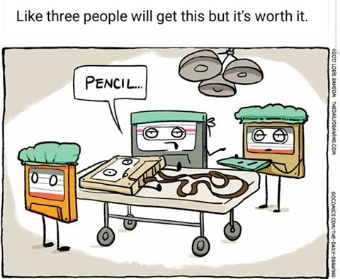
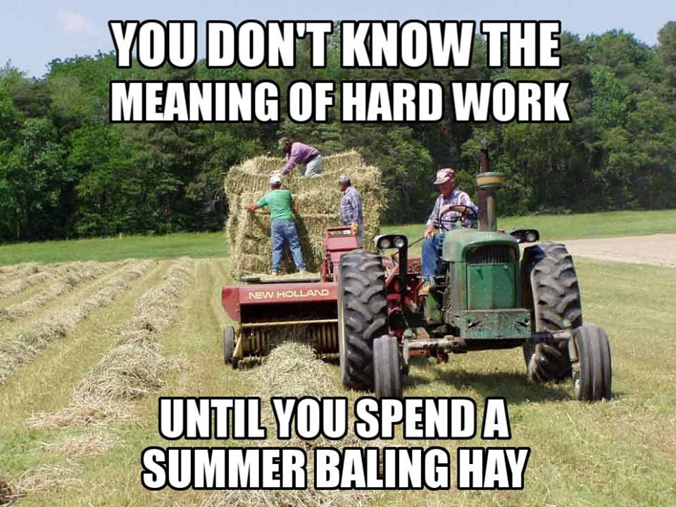
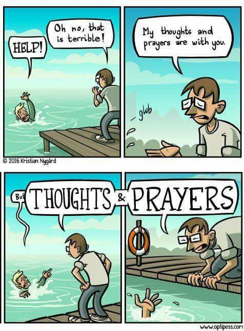
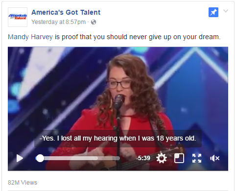
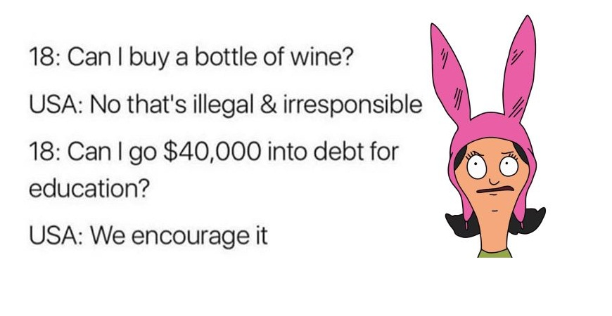
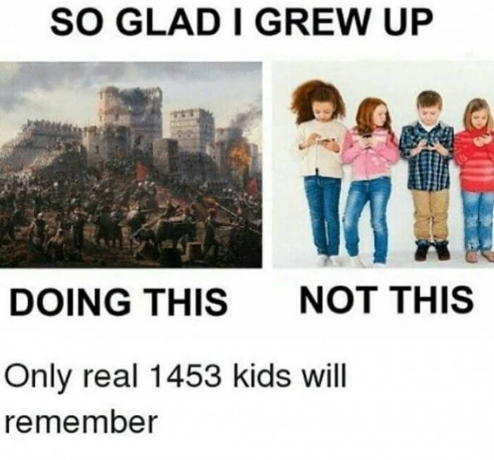

Today I saw a lot of memes on Facebook, and I was disappointed in humanity. First, for the memes, and second, for the content. So I grabbed a bunch of memes from my timeline. (Not all the memes, some of them were just dumb jokes. Also, I'm using the term "meme" quite loosely.)

First, the pencil joke:

I wouldn't even include this one if it wasn't for the text at the top: "Like three people will get this but it's worth it."

Here's a comic strip that's well done, but not particularly sharable... Until you add the text telling almost everyone that they are the genius that understands this joke. At least 50% of people must get the joke, is my estimate, but the text at the top is intended to make you feel good. And then you Like or Share it, and more people see it in their timeline.

-----

I guess you can tell that I'm growing up in the Mid-West with farming relatives:

This meme is similar the the first, but targets what they've done instead of what they know. While fewer people relate to this, those who do are probably going to Share and Like it more often.

If you've spent a summer baling hay, you want your friends to know. What better way to tell them, then to also tell them that they haven't worked hard?

-----

The inspirational, misleading meme:

"Do things that scare you, they're worth it."

Jumping off a cliff would scare me.

-----

Thoughts and prayers:

I found this to be pretty funny. In a case where the guy on the dock is in a position to help, it's pretty terrible that he's ignoring the drowning dude.

In cases where I've noticed people say this, I don't think they were in the position to help...

-----

Here's a girl who wrote a song about her situation, and sang it for America's Got Talent, even though she's deaf:

I watched it, and was impressed. Then again, I've been impressed with [many](https://www.youtube.com/watch?v=rk_qLtk0m2c) [Got](https://youtu.be/NS0L9RdPNvY?t=2m49s) [Talent](https://youtu.be/CVRe8lns3xc?t=39s) videos, each in different ways.

The caption is dumb. "Proof that you should never give up on your dream"? *Maybe* it's evidence that you should never give up on your dream. It's proof that some people *accomplish* their dreams. Maybe your dream is out of reach. Maybe you should get a more realistic dream.

-----

Now for some of the dumbest logic yet:

This makes just enough sense to click Like if you aren't really thinking about it, and never set eyes upon it again.

The meme is trying to say this:

> "Can I spend $20?" "No."
>
> "Can I spend $40,000?" "Yes."
>
> Subtext: Isn't that crazy?

Obviously it can be bad, even disastrous to go into debt. It's legal to go into debt. Colleges are a common method by which people go into debt. Should colleges be illegal? No! People can decide for themselves whether college is worth the investment.

The first part of the meme has nothing to do with the second part, which I just covered. It just mentions that alcohol is illegal for 18-year-olds in the U.S. I don't think it should be, but that's not really the point of the meme.

-----

I thought this was another one of those "I had no smartphone when I was a kid" memes:

Ha ha, nope! I think this meme is hilarious. But like most of the other memes, it suffers from terrible resolution and jpg compression.

It only makes sense with the context of the "so glad I grew up playing outdoors rather than playing with a screen" memes.

-----

So what's the point? I felt like complaining about what I see on Facebook. While I would like to blame the "algorithm" that tries to guess what I want to see, it's actually a lot of my friends interacting (Sharing/Liking) these posts that gets me to see them. And I've probably Liked and Shared a hundred dumb memes, so I'm not one to talk.

But if you see a meme on Facebook or Twitter, think about this: Is it a logical argument? Is it just appealing to pride?
