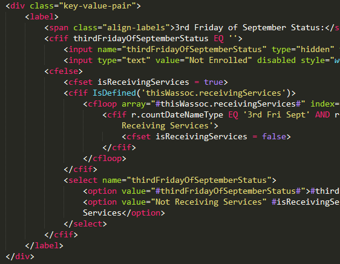
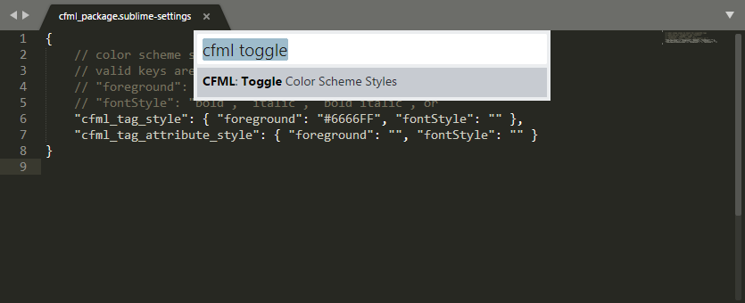
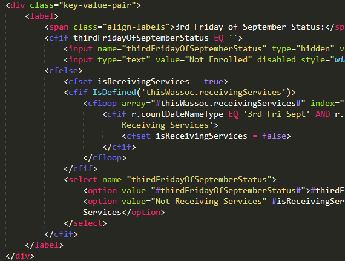

I use Sublime Text 3, and in my day job, I write and edit code in ColdFusion Markup Language (CFML), so I wanted a syntax highlighter. You can use Sublime's built-in HTML highlighter, but then you can't easily distinguish CFML tags from plain HTML tags:



Let me show you a more excellent way.

If you don't already have [Package Control](https://packagecontrol.io), then go to *Tools* > *Install Package Control*.

If you don't already have the CFML package, then press <kbd>Ctrl/Cmd</kbd><kbd>Shift</kbd><kbd>P</kbd>. Then type **Install Package**, and press <kbd>Enter</kbd>. Then type **CFML**, and press <kbd>Enter</kbd>.

If you want CFML tags to be visually distinct from HTML tags then go to *Preferences* > *Package Settings* > *CFML* > *Settings*, and paste the following code:

```json
{
	// color scheme styles to inject for Lucee/CFML tags
	// valid keys are "foreground" and "fontStyle"
	// "foreground": "#RRGGBB", "#RGB" or ""
	// "fontStyle": "bold", "italic", "bold italic", or ""
	"cfml_tag_style": { "foreground": "#4C9BB0", "fontStyle": "" },
	"cfml_tag_attribute_style": { "foreground": "", "fontStyle": "" }
}
```

Save the file.

The example code above will modify the tag style but not the attribute style. Customize it it to your liking.

To actually enable it, you must press <kbd>Ctrl/Cmd</kbd><kbd>Shift</kbd><kbd>P</kbd>. Then type **CFML Toggle**, and press <kbd>Enter</kbd>.



If you hate the CF tag color that you just chose, then go ahead and change the foreground color. You will have to run the **CFML Toggle** two times to see the new color.

Now your CFML files look like this:



I hope this helps!
