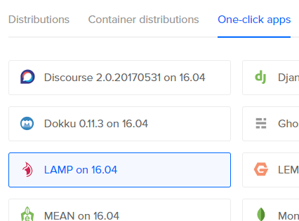
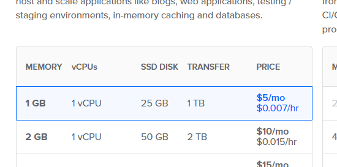
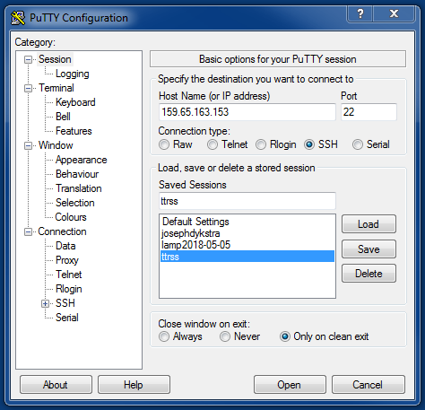
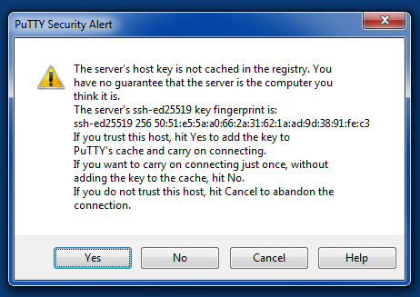
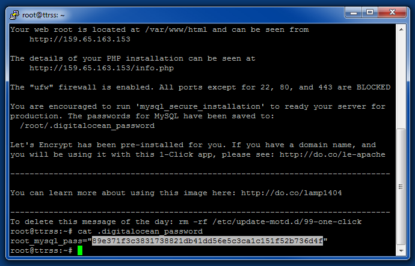
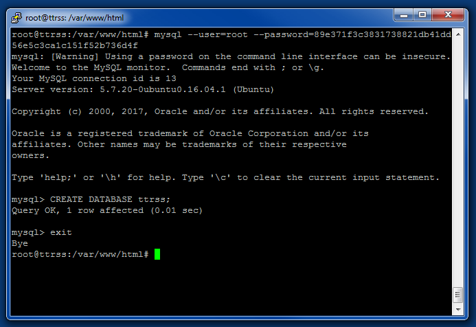
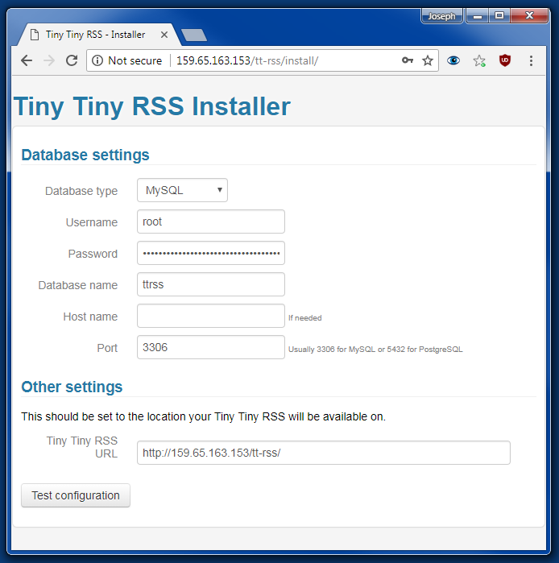
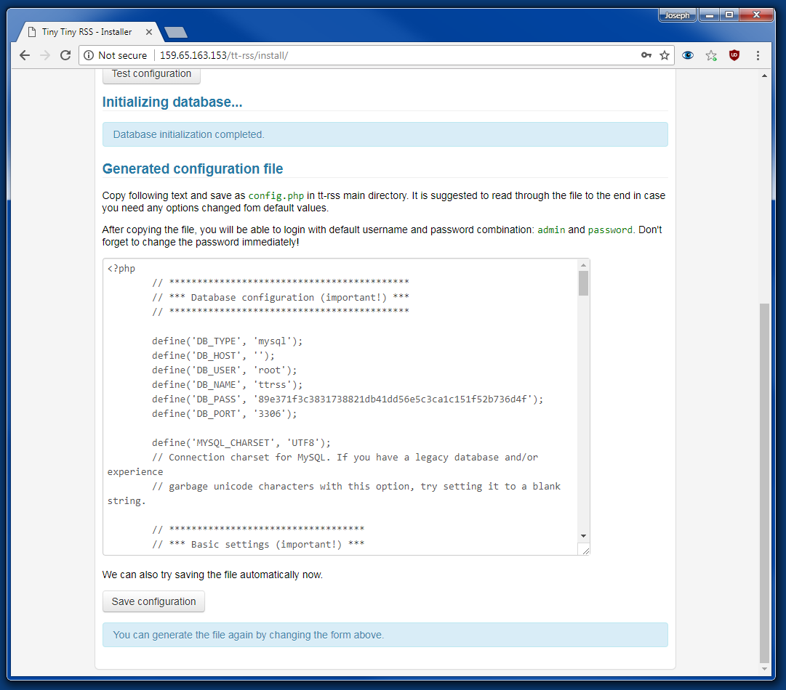
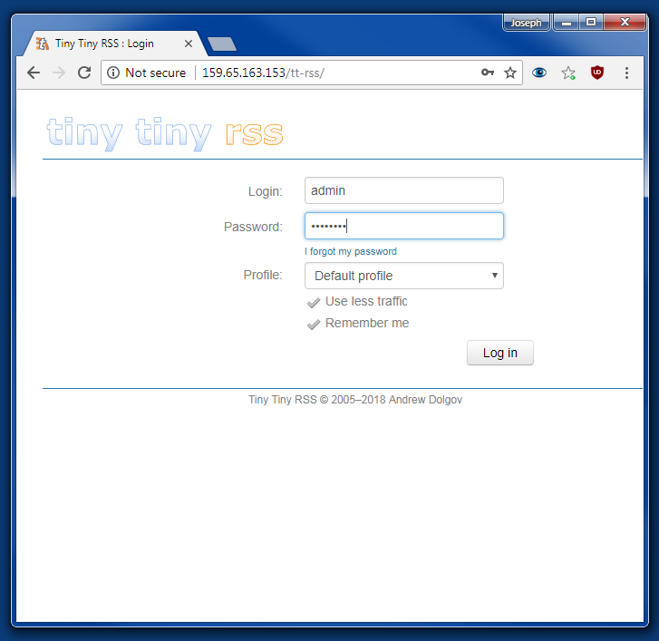

Setting up [Tiny Tiny RSS](https://tt-rss.org/) can be a bit tricky, even if you have some technical knowledge. I ran into a few issues when I set it up, and found solutions which I thought might come in handy for others who try to set up Tiny Tiny RSS.

## What you need:

- [Digital Ocean](https://www.digitalocean.com/) account
- SSH Client - I use [PuTTY](https://putty.org/) (Windows)

## Create the VPS

Log into your [Digital Ocean](https://www.digitalocean.com/) account, and create a new droplet. Choose the One-Click App called **LAMP on 16.04**.



I chose the cheapest, smallest server.



Hit **Create**!

## Login to the VPS

Open your SSH client, and log into your new VPS. You will need to copy the IP address from the Digital Ocean dashboard. If you did not add any SSH keys, then you will have to wait for the root password in an email. In my experience, this email can come 30 minutes after creating the server.

Login with the VPS's IP and the username **root**.



On your first login, you might have to accept the key fingerprint.



## Install MySQL

Get the MySQL password by running `cat .digitalocean_password`.

Copy the password. In PuTTY, selecting the text copies it to the clipboard.



Install MySQL by running `mysql_secure_installation --use-default`. When the password prompt pops up, paste the password. (In PuTTY, just right click to paste. You won't see the screen change.) Then press <kbd>Enter</kbd>.

## Set Up MySQL

```bash
mysql --user=root --password=[Your copied password]
mysql> CREATE DATABASE ttrss;
mysql> exit
```



## Install PHP Plugins

Paste the following commands into the console:

```bash
apt-get update
apt-get install php-mbstring -y
apt-get install php-xml -y
apt-get install php-curl -y
service apache2 restart
```

## Install Tiny Tiny RSS

```bash
cd /var/www/html
git clone https://tt-rss.org/git/tt-rss.git tt-rss
chmod -R 777 tt-rss
```

Visit **[IP]/tt-rss/install/** in your browser, and fill in the fields:

1. Database type is **MySQL**.
2. Username is **root**.
3. Password is the one you copied earlier.
4. Database name is whatever you put after the `CREATE DATABASE` command, in this case **ttrss**.
5. Leave Host name empty. (This is the host name for the database server, which defaults to **localhost**.)
6. Port is **3306**.
7. Tiny Tiny RSS URL should be left as-is.



Press **Test configuration**. I got a minor warning about internationalized domain names, which I ignored.

Press **Initialize database**.



Press **Save configuration**.

Visit **[IP]/tt-rss/** in your browser.

1. Login is **admin**.
2. Password is **password**.



Change the password when you log in!
